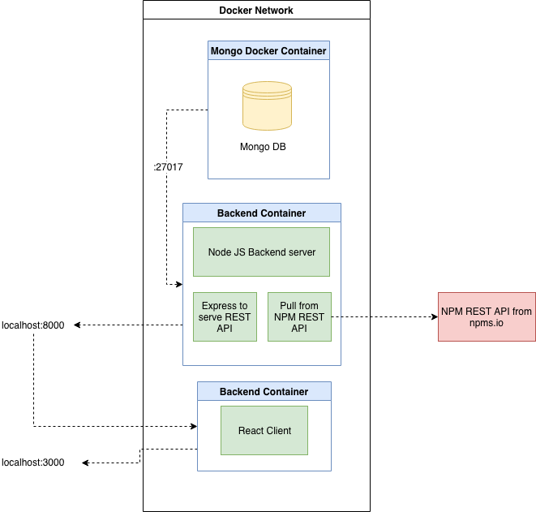

# Dependency Check

## Project Overview

Dependency Check is a dependency visualisation project, specifically for NPM, the package manager for Node.js. The project aims to:

1. Visually display the quality of a dependency package to make it easier to decide whether to use a depedency.
2. Display a a graph of all other dependencies that the package relies on in a number of intuitive ways.

The motivations for this project came from a need for a tool to analyse the quality of a potential dependency. I was working on building an API in Node.js for a large organisation so dependency quality management was a key factor in the development process. 

In addition, production servers were blocked from direct access to the web for security reasons. In order to install dependencies, firewall rules had to put in place for every dependency in the tree. It was essential therefore, that all dependencies used in the project had a low number of dependencies.

A tool such as Dependency Check can provide quality metrics as well as a dependency tree graph and dependency wheel to evaluate any NPM package.

## Installation

### Prerequisites

1. Have Docker installed on your machine.

### Process

Run:

```
$ docker-compose up
```

To access the application, navigate to ``http://localhost:3000`` in the browser.

## Demo

[](http://www.youtube.com/watch?v=rli4fReBgFg "Demo Video")

## About The Project

### Architecture

The project is split into three main components:

1. Backend Server
2. Database
3. Frontend

Each of the components have been dockerised interact as an application defined by the Docker Compose file.



### Backend Server

Because of the manipulation of data and focus on visualisation I felt that Node.js would be a strong choice to write the backend for the application. Because I knew I was going to use React for the front end too, having a single code-base would be a time saver. Node.js interacts with Mongo DB excellently too using Mongoose.

__The purpose of the backend server__ is to:

1. Crawl the dependencies for a given package
2. Store each dependency in the database for caching purposes as well as a data structure containing the crawl.
3. Serve a REST API for the Frontend.

The __NPMCrawler__ recursively traverses every dependency in the tree, caching any unseen nodes and pulling from the database for previously seen nodes. It also returns a data structure that represents a graph of the tree specifying the dependencies and their links.

The frontend can then query NPMCrawler to get the graph for any package in NPM. Initially, crawls can take a long time, especially if the tree is quite large and there is no cached data. However, the next time the package is called, the response will be instant.

### Database

I chose MongoDB for the database as it's great for large quantities of schema free data and is easy to Dockerise. It also interacts very well with Node js and there is a large body of resources available for getting Node and Mongo containers to interact with each other.

### Frontend

I decided to use React because I'm a big fan of the virtual DOM it provides and generally it provides an easy way to quickly mock up web applications.

I wanted to use D3 with React which presented some challenges as they both want to take control of the DOM. However, I overcame this by getting React to create the DOM object and passing the reference to D3.

### Visualisation Types

There are two things I wanted to focus on visualising:

1. Package Measurement
2. Package Dependencies

#### Package Measurement
Package Measurement includes information about the quality of the package code. NPM usefully provides quite a few normalised statistics as well as a three part score taking into account:

1. Quality
2. Popularity
3. Maintenance

I used a __donut chart__ to represent the measurement metrics.

#### Package Dependencies

I wanted to provide a couple of different views of the dependency tree. The first is a traditional graph based view and the second (a little bit more interesting) is a __Dependency Wheel__ with ribbons showing each dependencies relationship to all others in the tree.